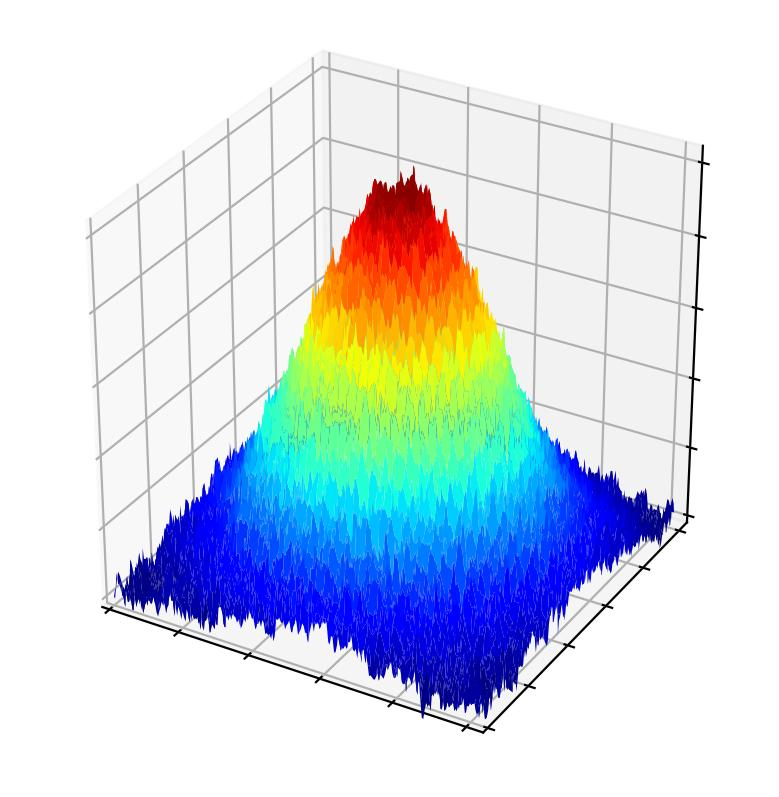
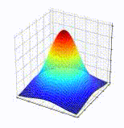

<br />
<div align="center">
    

  <h3 align="center">cuPPS</h3>

  <p align="center">
    A pseudospectral solver for systems of stochastics PDEs
    <br />
    <a href=""><strong>Read the docs »</strong></a>
    <br />
    <br />
  </p>
</div>

## Introduction

This library provides a framework for numerically integrating systems of 1st order PDEs (stochastic or deterministic) in a rectangular lattice, using a pseudospectral method. The integrator runs on NVIDIA GPUs through CUDA, but also supports running entirely on CPU, which can be faster for certain smaller lattices.

Detailed information about how to code a solver using this library can be found in the <a href=""><strong>docs</strong></a>.

## Compiling a solver
A number of example solvers can be found in the directory solvers. They can be compiled by compiling them together with the source files found in the directory `src`, for instance, the solver for model B, contained in `solvers/modelb.cpp`, can be compiled by

```
nvcc -O2 examples/modelb.cpp src/field_init.cpp src/field.cpp src/term_init.cpp src/term.cpp src/evolver.cpp src/field_kernels.cu src/term_kernels.cu -lcufft -lfftw3f -lcurand -DWITHCUDA -o modelb
```

Alternatively, the source files can be compiled into a library to then link to each solver. To do so, we can run the following once:
```
cd src/
g++ -c *cpp -DWITHCUDA -O2
nvcc -c *cu -DWITHCUDA -O2
ar rcs libcupss.a *o
```

This will create a static library called cupss in the file `libcupss.a`. To compile a solver, we can then simply compile it linking it to this library:
```
nvcc examples/modelb.cpp -Lsrc/ -lcufft -lfftw3f -curand -lcupss -O2 -o modelb
```

And then run it
```
./modelb
```
The solver outputs data by default to a directory called `data` from where it's called. The output files contain raw data of the states of the field at each timestep at which they're written out.


## What it calculates
See <a href=""><strong>here</strong></a>.

## What it supports
The solver supports any number of scalar fields $\lbrace\phi_i\rbrace$ on a rectangular lattice. Nonscalar fields such as vector fields must be split into as many scalar fields as components it has.

Each field $\phi_i$ can be updated through a dynamic rule, meaning it will solve an equation of the form
$$\partial_t\phi_i(t) = F_i[\lbrace\phi_j\rbrace]$$
or a static rule, meaning that each timestep the field is assigned a value as
$$\phi_i(t) = G_i[\lbrace\phi_j\rbrace]$$
Each field can be stochastic, so if it's updated through a dynamic rule, every timestep a noise term will be added according to:
$$\partial_t\phi_i(t) = F_i[\lbrace\phi_j\rbrace] + \eta_i$$
Where the noise is delta-correlated in space and time, or in Fourier space:
$$\langle\tilde\eta_i(k,\omega)\eta_j(k',\omega')\rangle = 2L(k)\delta(k+k')\delta(\omega+\omega')$$,
where $L(k)$ can be a constant or a power of wavelength $k$, allowing for several types of noise.

## What it does not support (yet)

 - Correlated noise.
 - Update rules other than Euler stepping (RK2, RK4, etc).
 - Compilable without CUDA so that it can run only on CPU.
 - More general functions of wavelength as prefactors, like generic powers.
 - Non rectangular lattices, curved lattices.

<br />
<div align="center">
    
</div>
