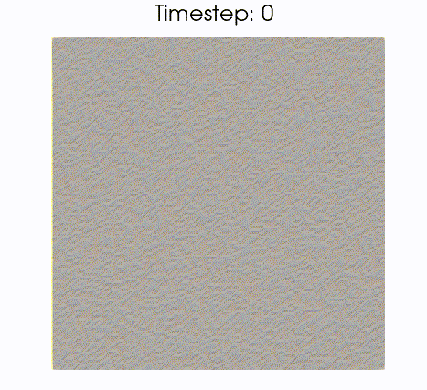
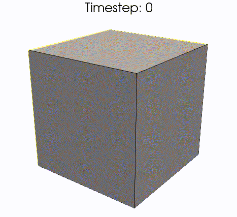

<br />
<div align="center">
    

  <h3 align="center">cuPSS</h3>

  <p align="center">
    A pseudospectral solver for systems of stochastics PDEs written in C++ & CUDA
      <br/>
      cuPSS is in early stages of development
    <br />
    <a href="https://github.com/fcaballerop/cuPSS/wiki"><strong>Read the wiki »</strong></a>
    <br />
    <a href="https://github.com/fcaballerop/cuPSS/wiki/Tutorials"><strong>Read the tutorials »</strong></a>
    <br />
    <br />
  </p>
</div>

## Introduction

This library provides a framework for numerically integrating systems of 1st order PDEs (stochastic or deterministic) in a rectangular lattice, using a pseudo-spectral method. The integrator runs on NVIDIA GPUs through CUDA, but also supports running entirely on CPU, which can be faster for certain smaller systems.

Detailed information about how to code a solver using this library can be found in the <a href="https://github.com/fcaballerop/cuPSS/wiki"><strong>wiki</strong></a>.

## Dependencies

 * CUDA toolkit (11+)
 * cuFFT
 * cuRAND
 * FFTW3 (with single point precision)

## Quickstart

### Installing dependencies

Install the <a href="https://developer.nvidia.com/cuda-toolkit">CUDA toolkit</a>. 

Install <a href="https://www.fftw.org/">fftw3</a> with single point precision. Follow their <a href="https://www.fftw.org/fftw3_doc/Installation-on-Unix.html">installation instructions</a> adding `--enable-float` to the `./configure` command.

### Compiling the library

To download cuPSS and test the examples, first clone the repository
```
git clone https://github.com/fcaballerop/cuPSS.git
cd cuPSS/
```

#### Option 1: Compilation with global installation
A CMake file is given for convenience, so cupss can be installed system wide by running (check dependencies above if any errors come up during compilation, specially fftw3 with single point precision).
```
mkdir build
cd build
cmake ../
cmake --build .
sudo cmake --install .
```
This will create a file `build/libcupss.a` which can the be linked to any particular solver. The last command will copy this library to `/usr/lib`, and the header files to `/usr/include`. 
#### Option 2: Compilation with local installation
If cmake is not available, or system wide installation is not possible, the library can be compiled in place, by running from the root directory
```
cd src
nvcc -c *cu -O2
ar rcs libcupss.a *o
cd ..
```
This will create a file `src/libcupss.a` which can be linked to any particular solver. The header files are in `inc`.

### Compiling and running an example

A number of example solvers can be found in the `examples` directory. They can be compiled with `nvcc`, linking the relevant libraries. For instance, the solver for model B, contained in `examples/cahn-hilliars.cpp`, can be compiled by
```
nvcc examples/cahn-hilliard.cpp --lcufft -lfftw3f -lcurand -lcupss -O2 -o cahn-hilliard
```
If cupss was not installed globally, the location of `libcupss.a` must be specified with the linker flag `-L`:
```
nvcc examples/cahn-hilliard.cpp -Lsrc/ -lcufft -lfftw3f -lcurand -lcupss -O2 -o cahn-hilliard
```
The linking flag `-Lsrc/` should be changed to wherever `libcupss.a` is located. It will be in `src/` if the library has been compiled with the lines above. The solver can be run with
```
./cahn-hilliard
```
The solver outputs data by default to a directory called `data` from where it's called. The output files contain raw data of the states of the field at each timestep at which they're written out.


These two images are the results of a Cahn-Hilliard solver in 2D and 3D, available in the examples.
<div align="center">
    
    
</div>

## What it calculates
See <a href=""><strong>here</strong></a>.

## What it supports
The solver supports any number of scalar fields $\lbrace\phi_i\rbrace$ on a rectangular lattice. Nonscalar fields such as vector fields must be split into as many scalar fields as components it has.

Each field $\phi_i$ can be updated through a dynamic rule, meaning it will solve an equation of the form
$$\partial_t\phi_i(t) = F_i[\lbrace\phi_j\rbrace]$$
or a static rule, meaning that each timestep the field is assigned a value as
$$\phi_i(t) = G_i[\lbrace\phi_j\rbrace]$$
Each field can be stochastic, so if it's updated through a dynamic rule, every timestep a noise term will be added according to:
$$\partial_t\phi_i(t) = F_i[\lbrace\phi_j\rbrace] + \eta_i$$
Where the noise is delta-correlated in space and time, or in Fourier space:
$$\langle\tilde\eta_i(k,\omega)\eta_j(k',\omega')\rangle = 2L(k)\delta(k+k')\delta(\omega+\omega')$$,
where $L(k)$ can be a constant or a power of wavelength $k$, allowing for several types of noise.

## What it does not support (yet)
 - Compilable without CUDA so that it can run only on CPU.
 - Option for double precision integration.

<br />
<div align="center">
    
</div>
